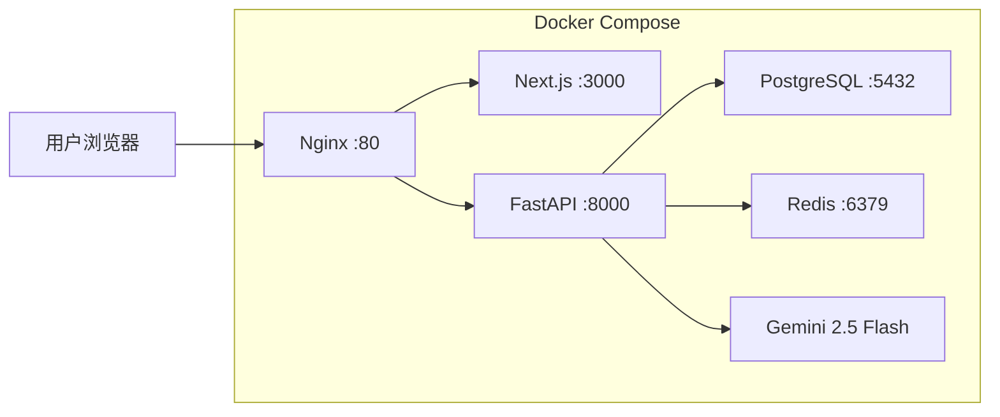

# 🏗️ 掘进工作面规程智能生成平台 — 全模块验证看板

> **验证日期**: 2026-03-18 &nbsp;|&nbsp; **平台版本**: v0.1.0 &nbsp;|&nbsp; **环境**: Docker Compose (5 容器)

---

## 📊 总览仪表盘

| 指标 | 数值 |
|------|:----:|
| **验证模块** | 9 / 9 ✅ |
| **修复 Bug** | 4 个 |
| **优化任务** | P0-P5 全部完成 |
| **种子数据** | 8 文档 + 28 条款 + 12 规则 |
| **pytest 通过率** | 19/19 (100%) |
| **核心链路** | 全贯通 ✅ |
| **代码改动文件** | 14 个 |

---

## 🔥 P5: 核心业务链路验证

**测试场景**: IV 类围岩 / 高瓦斯 / 拱形断面 5.2×3.8m / 煤巷 1200m


### 规则匹配结果 (5/12 命中)

| 规则名称 | 分类 | 优先级 | 命中条件 |
|----------|:----:|:------:|---------|
| IV/V类围岩锚索加强支护 | 支护 | 10 | `rock_class ∈ [IV,V]` |
| 高瓦斯/突出矿井双风机双电源 | 通风 | 10 | `gas_level ∈ [高瓦斯,突出]` |
| 大断面加强支护（宽≥5m） | 支护 | 9 | `section_width ≥ 5.0` |
| 长距离掘进加大风筒 | 通风 | 8 | `excavation_length ≥ 1000` |
| 自燃煤层防灭火措施 | 安全 | 8 | `spontaneous_combustion ∈ [容易自燃,自燃]` |

### 计算引擎结果

| 参数 | 值 |
|------|---:|
| 断面净面积 | 16.86 m² |
| 锚杆锚固力 | 67.81 kN |
| 每排锚杆数 | 6 根 |
| 安全系数 | 1.8 |
| 最终配风量 | 400.0 m³/min |
| 推荐局扇 | FBD-6.3/2×22 (44 kW) |

### 生成文档结构

| 章节 | 标题 | 来源 | 预警 |
|:----:|------|:----:|:----:|
| 第一章 | 工程概况 | 模板 | — |
| 第二章 | 支护设计 | 计算引擎 | ⚠ |
| 第三章 | 通风系统 | 计算引擎 | ⚠ |
| 第四章 | 编制依据与规则命中 | 规则匹配 | — |
| 第五章 | 安全技术措施 | 模板 | — |

---

## 🏛️ 平台架构



---

## ✅ 9 模块验证

````carousel

<!-- slide -->

<!-- slide -->

<!-- slide -->

<!-- slide -->

<!-- slide -->

````

---

## 📚 P3: 种子数据

| 类别 | 内容 | 数量 |
|------|------|:----:|
| 标准库 | 法律法规/技术规范/安全规程/集团标准 | 8 文档 28 条款 |
| 规则库 | 支护/通风/安全 | 3 组 12 规则 |

---

## 🧪 P4: pytest 全绿

```
======================== 19 passed, 6 warnings in 6.29s ========================
```

| 测试文件 | 用例 | 结果 |
|----------|:----:|:----:|
| test_health | 1 | ✅ |
| test_auth | 3 | ✅ |
| test_standards | 4 | ✅ |
| test_rules | 4 | ✅ |
| test_projects | 4 | ✅ |
| test_calc | 3 | ✅ |

---

## 🔧 全部改动文件

| 文件 | 改动说明 |
|------|---------|
| [project.py (model)](file:///Users/imac2026/Desktop/掘进工作面规程智能生成平台/backend/app/models/project.py) | mine relationship + cascade delete-orphan |
| [project.py (schema)](file:///Users/imac2026/Desktop/掘进工作面规程智能生成平台/backend/app/schemas/project.py) | mine_name + from_orm_with_mine |
| [project.py (api)](file:///Users/imac2026/Desktop/掘进工作面规程智能生成平台/backend/app/api/v1/project.py) | from_orm_with_mine |
| [page.tsx](file:///Users/imac2026/Desktop/掘进工作面规程智能生成平台/frontend/src/app/dashboard/projects/page.tsx) | 矿井下拉选择器 |
| [seed_data.py](file:///Users/imac2026/Desktop/掘进工作面规程智能生成平台/backend/scripts/seed_data.py) | 种子数据脚本 |
| [conftest.py](file:///Users/imac2026/Desktop/掘进工作面规程智能生成平台/backend/tests/conftest.py) | dependency_overrides |
| [test_auth.py](file:///Users/imac2026/Desktop/掘进工作面规程智能生成平台/backend/tests/test_auth.py) | 认证测试 |
| [test_standards.py](file:///Users/imac2026/Desktop/掘进工作面规程智能生成平台/backend/tests/test_standards.py) | 标准库 CRUD |
| [test_rules.py](file:///Users/imac2026/Desktop/掘进工作面规程智能生成平台/backend/tests/test_rules.py) | 规则引擎 CRUD |
| [test_projects.py](file:///Users/imac2026/Desktop/掘进工作面规程智能生成平台/backend/tests/test_projects.py) | 项目管理 CRUD |
| [test_calc.py](file:///Users/imac2026/Desktop/掘进工作面规程智能生成平台/backend/tests/test_calc.py) | 计算引擎 |
| [pytest.ini](file:///Users/imac2026/Desktop/掘进工作面规程智能生成平台/backend/pytest.ini) | asyncio_mode=auto |
