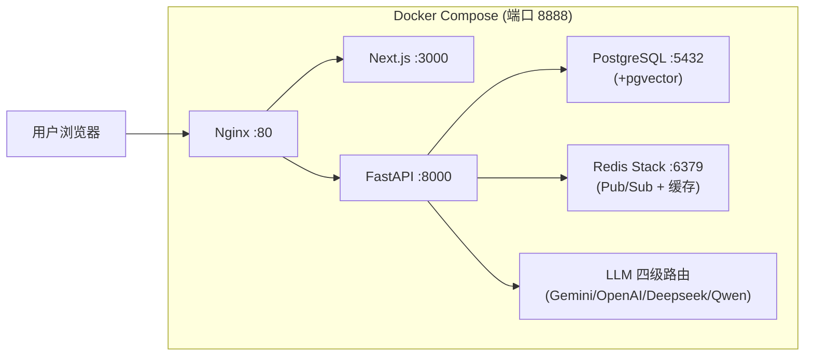

# 🏗️ 鲜标智投 — 全模块完成情况看板

> **更新日期**：2026-04-05 &nbsp;|&nbsp; **平台版本**：v0.4.x &nbsp;|&nbsp; **环境**：Docker Compose (5 容器)
> **代码仓库**：jdeng0936-blip/shengxianshicai &nbsp;|&nbsp; **最后推送**：2026-04-04 17:06

---

## 📊 总览仪表盘

| 指标 | 数值 |
|------|:----:|
| **완成 Week** | W1 → W5 全部完成 |
| **API 路由文件** | 19 个 |
| **后端服务文件** | 32 个（含 generation/ 7节点）|
| **ORM 数据模型** | 18 张表 |
| **测试文件** | 23 个 |
| **七节点流水线** | Node1-7 全实现 ✅ |

---

## ✅ 已完成功能全览

### W1 — 基础架构
- [x] RBAC 权限体系（角色 + 权限隔离）
- [x] 统一日志系统
- [x] 租户安全测试（多租户 tenant_id 隔离）
- [x] Alembic 迁移目录统一

### W2 — 商业闭环
- [x] 风险报告（`risk_report_service.py`）
- [x] Word/PDF 导出增强（`bid_doc_exporter.py`）
- [x] 计费基础（`billing_service.py` + `billing.py` API）

### W3 — AI 生成质量
- [x] AI 生成质量强化
- [x] 计费中心完善
- [x] 企业完整度评分
- [x] 报价预警
- [x] 围串标语义相似度检测（3维度：embedding + N-gram + 段落哈希，25条测试）
- [x] 文本差异化引擎（L1同义替换 + L2句式重组 + 保护机制，18条测试）
- [x] 企业能力画像 v1 — 五维雷达（硬件/合规/服务/文档/竞争）+ 匹配度 API（13条测试）

### W4 — E2E 稳定性
- [x] E2E 全链路测试扩展至 16 步
- [x] 安全回归（P0 安全红线修复）
- [x] 种子案例数据
- [x] 法律页面（免责声明/隐私/条款）
- [x] 资质到期预警（四级分色 + 投标拦截）
- [x] 投标检查清单（保证金/盖章/打印装订提醒）
- [x] 导出后弹窗交付关卡

### W5 — 高级功能
- [x] 商机漏斗（多平台抓取 → AI 匹配分析）
- [x] 企业能力画像完整版
- [x] 计费中心完整版
- [x] 知识库重构
- [x] 前端全面增强

### Phase 1.2 — 七节点生成流水线
- [x] **Node1**: `planner.py` — 大纲规划（14条测试）
- [x] **Node2**: `retriever.py` — RAG 检索（多租户 pgvector）
- [x] **Node3**: `writer.py` — 草稿生成（12条测试）
- [x] **Node4**: `compliance_gate.py` — 合规门禁（L1格式+L2语义+L3废标，18条测试）
- [x] **Node5**: `polish_pipeline.py` — 多轮润色（术语标准化+文风适配，15条测试）
- [x] **Node6**: `reviewer.py` — Critic 审核（L1语义覆盖率+L2 LLM建议+L3覆盖率热图）
- [x] **Node7**: `formatter.py` — 最终格式化

### 最新完成（截至 2026-04-04）
- [x] 支付中心模块（`payment_service.py` + API + ORM + Alembic迁移 + 测试）
- [x] LLM 四级降级路由 + 熔断器（Circuit Breaker）
- [x] WebSocket 实时生成管线进度（Redis Pub/Sub + 七节点埋点）
- [x] 解析任务状态迁移至 Redis（分布式锁防重入 + TTL）
- [x] 反AI检测引擎（五维度 + L2 N-gram基线 + KL散度）
- [x] 前端反AI检测面板 + 一键降AI润色
- [x] 章节编辑器 edit_ratio 仪表盘（用户编辑占比展示）
- [x] 195号文合规增强（跨章节一致性 + 资质引用验证）
- [x] 移动端响应式适配
- [x] db 脚本更新 + 评分提取测试

---

## 🏛️ 当前架构



---

## 🔄 七节点生成流水线状态

```
招标文件上传
  ↓
Node1: planner.py        [✅ 实现 + 14条测试]
  ↓
Node2: retriever.py      [✅ 实现 + RAG多租户隔离]
  ↓
Node3: writer.py         [✅ 实现 + 12条测试]
  ↓
Node4: compliance_gate.py [✅ L1+L2+L3三级审查 + 18条测试]
  ↓
Node5: polish_pipeline.py [✅ 术语标准化+文风适配 + 15条测试]
  ↓
Node6: reviewer.py       [✅ L1语义+L2 LLM+L3热图]
  ↓
Node7: formatter.py      [✅ 最终格式化]
  ↓
导出（Word/PDF）+ WebSocket 实时进度推送
```

---

## 🧪 测试覆盖（23个测试文件）

| 测试文件 | 覆盖范围 |
|---------|---------|
| test_e2e_full_flow.py | E2E 全链路 16步 |
| test_doc_e2e.py | 文档生成 E2E |
| test_generation_planner.py | Node1 大纲规划 |
| test_generation_retriever.py | Node2 RAG 检索 |
| test_generation_writer.py | Node3 草稿生成 |
| test_generation_compliance_gate.py | Node4 合规门禁 |
| test_generation_polish_pipeline.py | Node5 润色流水线 |
| test_generation_reviewer.py | Node6 评审 |
| test_generation_formatter.py | Node7 格式化 |
| test_bid_compliance.py | 合规服务 |
| test_bid_projects.py | 项目管理 |
| test_bid_chapter_engine.py | 章节引擎 |
| test_payment.py | 支付中心（最新）|
| test_industry_vocab.py | 行业词汇 |
| test_llm_selector.py | LLM 路由选择 |
| test_auth.py | 认证 |
| test_api.py | API 基础 |
| test_health.py | 健康检查 |
| test_validate.py | 数据校验 |
| test_fetch.py | 数据抓取 |
| test_logs.py | 日志 |

---

## ⏭️ 待继续的方向（基于 BidEngine 合并方案）

根据 `docs/BidEngine_通用投标AI框架_合并实施方案.md`，当前项目已完成 **Phase 1**（7节点引擎），后续阶段：

| 阶段 | 目标 | 状态 |
|------|------|------|
| **Phase 2** | 行业插件化抽象（`IndustryPlugin` 基类 + 2个插件） | ⬜ 待开发 |
| **Phase 3** | 评分点驱动目录 + 变体生成引擎 + 前端工作台融合 | ⬜ 待开发 |
| **Phase 4** | 新行业验证（IT服务/物业/医疗）+ 稳定化 | ⬜ 待开发 |

**当前可立即继续的任务（按优先级）：**
1. 🧪 先跑 pytest 确认 23 个测试文件全绿（上次拉取后未验证）
2. 💳 支付中心前端页面对接（后端已就绪，前端缺页面）
3. 🏭 Phase 2 行业插件化 — `IndustryPlugin` 基类设计
4. 📊 评分点提取服务（`scoring_extract_service.py`）
